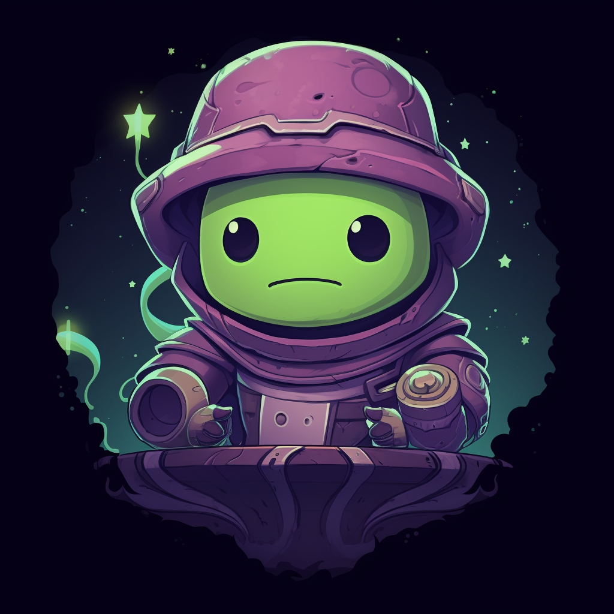

# Custodian

Custodian is a Discord bot designed to assist with message management, including cleanup of old messages, reminders, and recurring tasks. It is built to run **100% for free** on Cloudflare Workers and Cloudflare D1 (Serverless Database).



## Features

- **Serverless Architecture**: Runs entirely on Cloudflare Workers (0-cost, 24/7 uptime).
- **Persistent Data**: Uses Cloudflare D1 (SQLite) for free and reliable data storage.
- **Message Cleanup**:
  - Immediate cleanup of messages older than a specified period (e.g. 1h, 1d)
  - Recurring cleanup tasks at specified intervals via Cloudflare Cron Triggers
  - View and manage cleanup schedules
- **Reminders**:
  - Set one-time reminders in any channel
  - List active reminders
  - Delete reminders

## Setup & Deployment

To deploy Custodian to Cloudflare, follow these steps:

### Prerequisites

- Node.js (version 18 or higher)
- A Cloudflare account (Free tier is perfect)
- A Discord Application/Bot

### 1. Local Configuration

Clone the repository and install dependencies:

```bash
git clone <repository_url>
cd custodian
npm install
```

### 2. Discord Application Setup

1. Go to the [Discord Developer Portal](https://discord.com/developers/applications).
2. Create a new Application.
3. Note your **Client ID**, **Public Key**, and **Bot Token**.

### 3. Cloudflare Setup

Log into Cloudflare via Wrangler:

```bash
npx wrangler login
```

Create a D1 database:

```bash
npx wrangler d1 create custodian_db
```

Update your `wrangler.toml` file with the `database_id` generated from the previous command.

### 4. Initialize Database Schema

Apply the database schema to your local and remote D1 database:

```bash
# Local testing
npx wrangler d1 execute custodian_db --local --file=./schema.sql

# Production
npx wrangler d1 execute custodian_db --remote --file=./schema.sql
```

### 5. Set Environment Variables (Secrets)

Set your Discord credentials as Cloudflare secrets:

```bash
npx wrangler secret put DISCORD_BOT_TOKEN
npx wrangler secret put CLIENT_ID
npx wrangler secret put PUBLIC_KEY
```

### 6. Deploy to Cloudflare

Deploy the worker to Cloudflare:

```bash
npx wrangler deploy
```

After deployment, Cloudflare will provide a URL (e.g., `https://custodian-bot.<your-subdomain>.workers.dev`). 

### 7. Link to Discord

1. Go back to your Discord Developer Portal -> General Information.
2. Set the **Interactions Endpoint URL** to your Cloudflare Worker URL + `/interactions`.
   - Example: `https://custodian-bot.your-subdomain.workers.dev/interactions`
3. Save changes.

### 8. Deploy Slash Commands

Finally, register the slash commands with Discord:

```bash
# Make sure you have a .env file locally with DISCORD_BOT_TOKEN and CLIENT_ID
node deploy-commands.js
```

## Usage

Once the bot is running and commands are deployed, you can use the following commands in your Discord server:

### Cleanup Commands (Requires Manage Messages)
- `/cleanup` - Clean up messages older than specified period
- `/setrecurringcleanup` - Set up recurring cleanup
- `/viewcleanupschedule` - View all active recurring cleanup schedules
- `/cancelrecurringcleanup` - Cancel a recurring cleanup task
- `/editrecurringcleanup` - Edit a recurring cleanup task

### Reminder Commands
- `/setreminder` - Set a reminder in a channel
- `/listreminders` - List all active reminders
- `/deletereminder` - Delete a reminder

### General Commands
- `/help` - Show available commands

## Contributing

1. Fork the repository
2. Create your feature branch (`git checkout -b feature/amazing-feature`)
3. Commit your changes (`git commit -m 'Add some amazing feature'`)
4. Push to the branch (`git push origin feature/amazing-feature`)
5. Open a Pull Request

## License

This project is licensed under the ISC License.

---

© 2024 Custodian. Maintained by ShibbityShwab.